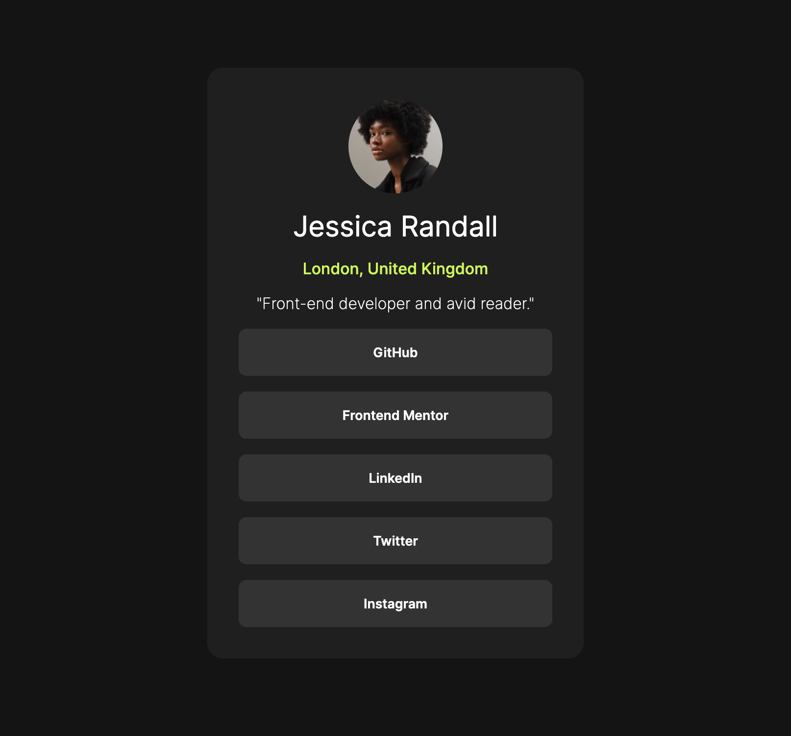
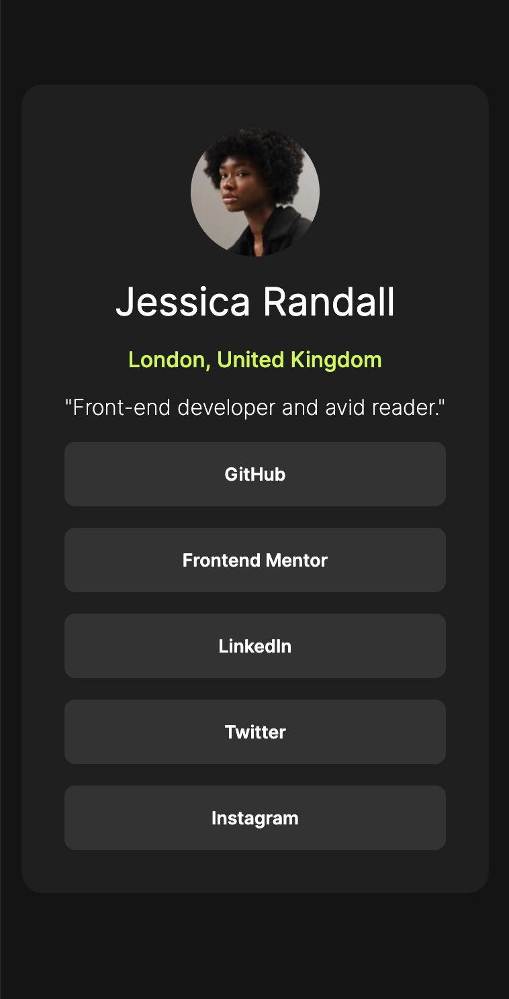

# Custom Link Tree Replica

This is my solution of the [Social links profile challenge on Frontend Mentor](https://www.frontendmentor.io/challenges/social-links-profile-UG32l9m6dQ).

## Table of contents

- [Overview](#overview)
  - [The challenge](#the-challenge)
  - [Screenshot](#screenshot)
- [My process](#my-process)
  - [Built with](#built-with)

## Overview

### The challenge

Users should be able to:

- See hover and focus states for all interactive elements on the page

### Screenshot

### Desktop view

### Mobile view

### Active Link
[Try it out!](https://derek-walton.github.io/Responsive-Webpage/)

## My process

### Built with

- Semantic HTML5 markup
- CSS custom properties
- Flexbox

## Thank you for reading 👋
